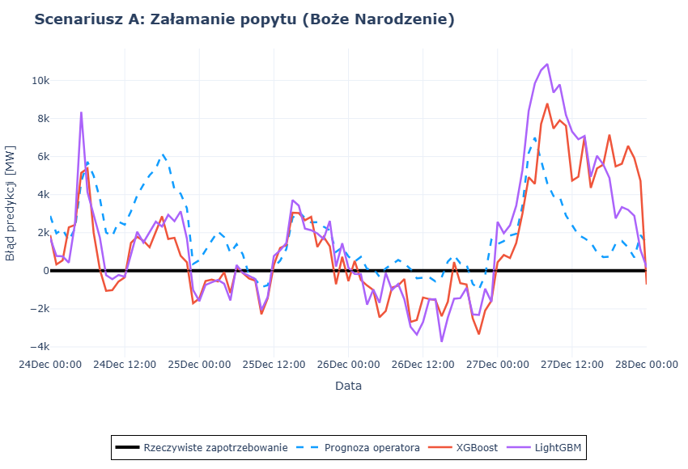
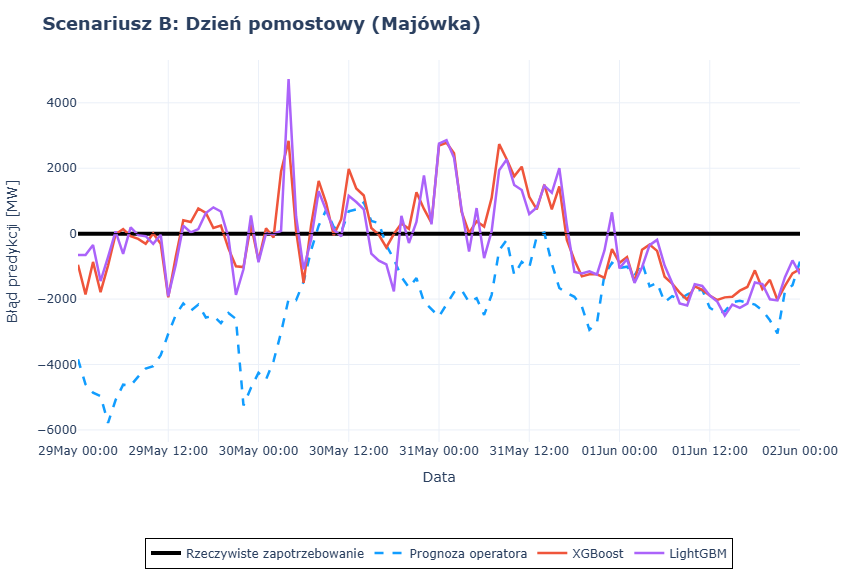
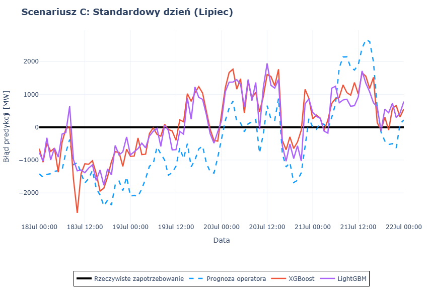

[-green)](#)

## 📌 O projekcie
Niniejszy projekt przedstawia kompleksowe podejście oparte na uczeniu maszynowym do krótkoterminowego prognozowania zapotrzebowania na moc (STLF - *Short-Term Load Forecasting*) w Krajowym Systemie Elektroenergetycznym. Głównym celem było zbudowanie modelu predykcyjnego zdolnego do pokonania oficjalnych prognoz operacyjnych dostarczanych przez europejskiego operatora **ENTSO-E**. 

Dzięki inżynierii cech (skupionej w szczególności na anomaliach kalendarzowych) oraz optymalizacji hiperparametrów, opracowany model **LightGBM** osiągnął wysoką dokładność, drastycznie redukując wariancję predykcji podczas krytycznych zdarzeń w sieci.

## 💡 Wartość biznesowa i kluczowe wnioski
W sektorze energetycznym skrajne błędy predykcji (silnie penalizowane przez metrykę RMSE) przekładają się bezpośrednio na kosztowne uruchamianie rezerw oraz interwencyjnych elektrowni szczytowo-pompowych. 

**Ostateczny sukces tego projektu obrazuje anomalia matematyczna wygenerowana przez model:**
> 🏆 Błąd średniokwadratowy (**RMSE**) nastrojonego modelu LightGBM (1586.44 MW) okazał się znacznie niższy niż średni błąd bezwzględny (**MAE**) oficjalnej prognozy ENTSO-E (1989.40 MW). 

Dowodzi to, że model Machine Learning nawet w momentach swoich *największych pomyłek i skrajnych odchyleń* (RMSE) jest nadal dokładniejszy niż państwowy system operatora w swoim ujęciu *uśrednionym* (MAE).

## 📊 Ewaluacja skuteczności modeli

W celu uniknięcia zjawiska wycieku danych zastosowano rygorystyczną, chronologiczną walidację `TimeSeriesSplit` (`shuffle=False`). Poniższa tabela przedstawia wyniki wszystkich sprawdzonych modeli na tle rynkowego punktu odniesienia:

| Model / Benchmark                 | MAPE (%) | RMSE (MW) | MAE (MW) |
|:----------------------------------|:---:|:---:|:---:|
| *LightGBM*                        | **1.95%** | **1586.44** | **1105.74** |
| *XGBoost*                         | 1.96% | 1599.07 | 1109.28 |
| *Random Forest*                   | 2.15% | 1736.33 | 1223.36 |
| *LSTM*                            | 2.41% | 2351.24 | 1353.48 |
| *Decision Tree*                   | 2.85% | 2353.53 | 1546.38 |
| **ENTSO-E (Oficjalny Benchmark)** | **3.52%** | **2488.29** | **1989.40** |
| *GRU*                             | 5.36% | 3932.09 | 2814.48 |
| *Amazon Chronos T5*               | 8.65% | 4687.02 | 4163.71 |
| *Linear Regression*               | 5.22% | 4747.49 | 2781.51 |

## 🧠 Inżynieria cech (Feature Engineering)
Sukces modeli drzewiastych nad Głębokim Uczeniem (LSTM) oraz potężnymi modelami Zero-Shot (Amazon Chronos) wynikał z agresywnej, specyficznej dla domeny inżynierii cech m.in:
* **`IsBridgeDay` (Dni pomostowe):** Logika identyfikująca pracujące piątki/poniedziałki wciśnięte między czwartkowe/wtorkowe święto ustawowe a weekend. Zapobiegła ona "halucynacjom" modeli o standardowych skokach popytu przemysłowego w te dni.
* **`DaysUntilHoliday`:** Zmienna odliczająca dni do najbliższego święta, pozwalająca algorytmom uchwycić stopniowe przedświąteczne zmniejszanie zapotrzebowania na prąd.

## 📈 Wizualizacja Odchyleń (Analiza Reszt)
Zamiast standardowych wykresów wartości absolutnych (których szeroka skala nie pozwala na celne pokazanie błędó predykcji), ewaluację modeli przeprowadzono przy użyciu **Wykresów Odchyleń (Residuals)** w kilku oknach czasowych.

* `Scenariusz A:`

* `Scenariusz B:`

* `Scenariusz C:`

## 🛠️ Stos technologiczny
* **Przetwarzanie danych:** `Pandas`, `NumPy`
* **Machine Learning:** `LightGBM`, `XGBoost`, `Scikit-Learn` (RandomizedSearchCV)
* **Modele referencyjne:** `PyTorch`, `Keras` (LSTM), `Amazon Chronos` (Zero-shot Foundation Model)
* **Wizualizacja:** `Plotly` (Interaktywne szeregi czasowe i wykresy reszt)

## ⚙️ Uruchomienie lokalne
1. Sklonuj repozytorium: `git clone https://github.com/marekburkot-work/energy-consumption-forecasting-ai`
2. Zainstaluj wymagane pakiety: `pip install -r requirements.txt`
3. Uruchom notatnik Jupyter `main.ipynb`, aby wykonać pełen potok (Data Prep -> Feature Eng -> Trening -> Ewaluacja Plotly).~~
